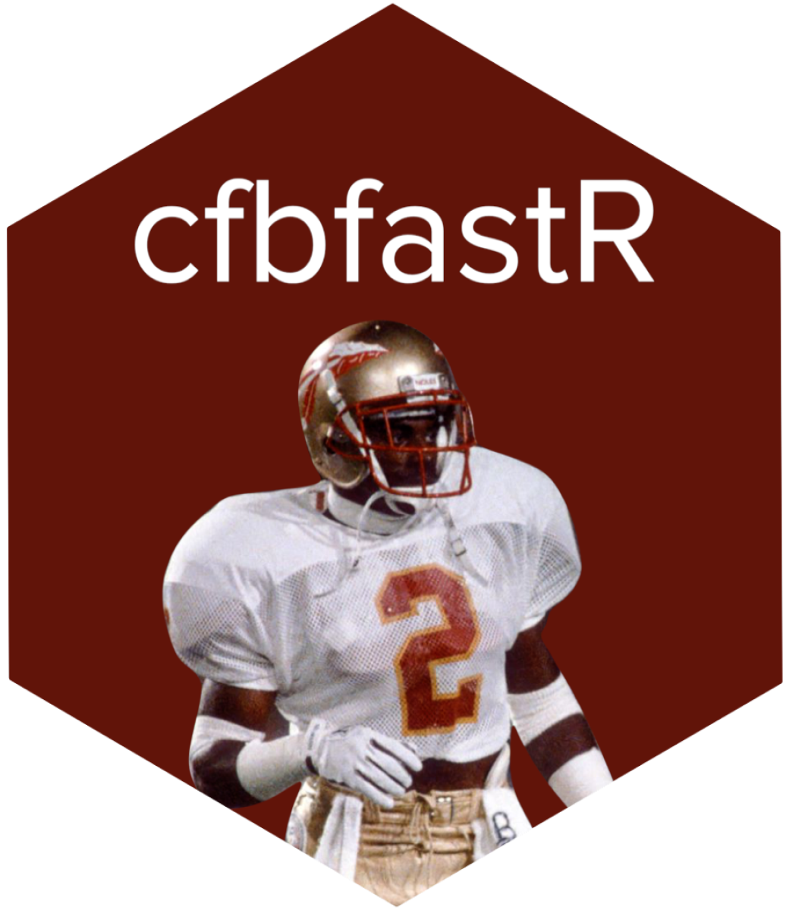

# 

# **cfbfastR** <a href='http://saiemgilani.github.io/cfbfastR'></a>

<!-- badges: start -->

[](https://github.com/saiemgilani/cfbfastR/)
[](https://github.com/saiemgilani/cfbfastR/actions/workflows/R-CMD-check.yaml)
[](https://github.com/saiemgilani/cfbfastR/)
[](https://github.com/saiemgilani/cfbfastR/graphs/contributors)
[](https://twitter.com/cfbfastR)
<!-- badges: end -->

The goal of [**`cfbfastR`**](https://saiemgilani.github.io/cfbfastR/) is
to provide the community with an R package for working with CFB data. It
is an R API wrapper around <https://collegefootballdata.com/>. Beyond
data aggregation and tidying ease, one of the multitude of services that
[**`cfbfastR`**](https://saiemgilani.github.io/cfbfastR/) provides is
for benchmarking open-source expected points and win probability
metrics.

## **Installation**

You can install the released version of
[**`cfbfastR`**](https://github.com/saiemgilani/cfbfastR/) from
[GitHub](https://github.com/saiemgilani/cfbfastR) with:

``` r
# You can install using the pacman package using the following code:
if (!requireNamespace('pacman', quietly = TRUE)){
  install.packages('pacman')
}
pacman::p_load_current_gh("saiemgilani/cfbfastR")
```

``` r
# if you would prefer devtools installation
if (!requireNamespace('devtools', quietly = TRUE)){
  install.packages('devtools')
}
# Alternatively, using the devtools package:
devtools::install_github(repo = "saiemgilani/cfbfastR")
```

## **Breaking Changes**

[**Full News on
Releases**](https://saiemgilani.github.io/cfbfastR/news/index.html)

#### **College Football Data API Keys**

The [CollegeFootballData API](https://collegefootballdata.com/) now
requires an API key, here’s a quick run-down:

-   To get an API key, follow the directions here: [College Football
    Data Key Registration.](https://collegefootballdata.com/key)

-   Using the key: You can save the key for consistent usage by adding
    `CFBD_API_KEY=XXXX-YOUR-API-KEY-HERE-XXXXX` to your .Renviron file
    (easily accessed via
    [**`usethis::edit_r_environ()`**](https://usethis.r-lib.org/reference/edit.html)).
    Run
    [**`usethis::edit_r_environ()`**](https://usethis.r-lib.org/reference/edit.html),
    a new script will pop open named `.Renviron`, **THEN** paste the
    following in the new script that pops up (with**out** quotations)

``` r
CFBD_API_KEY = XXXX-YOUR-API-KEY-HERE-XXXXX
```

Save the script and restart your RStudio session, by clicking `Session`
(in between `Plots` and `Build`) and click `Restart R` (there also
exists the shortcut `Ctrl + Shift + F10` to restart your session). If
set correctly, from then on you should be able to use any of the `cfbd_`
functions without any other changes.

-   For less consistent usage: At the beginning of every session or
    within an R environment, save your API key as the environment
    variable `CFBD_API_KEY` (with quotations) using a command like the
    following.

``` r
Sys.setenv(CFBD_API_KEY = "XXXX-YOUR-API-KEY-HERE-XXXXX")
```

# Follow [cfbfastR](https://twitter.com/cfbfastR) on Twitter and star this repo

[](https://twitter.com/cfbfastR)

[](https://github.com/saiemgilani/cfbfastR/stargazers/)

# **Our Authors**

-   [Saiem Gilani](https://twitter.com/saiemgilani)  
    <a href="https://twitter.com/saiemgilani" target="blank"></a>
    <a href="https://github.com/saiemgilani" target="blank"></a>

-   [Akshay Easwaran](https://twitter.com/akeaswaran)  
    <a href="https://twitter.com/akeaswaran" target="blank"></a>
    <a href="https://github.com/akeaswaran" target="blank"></a>

-   [Jared Lee](https://twitter.com/JaredDLee) </br>
    <a href="https://twitter.com/JaredDLee" target="blank"></a>
    <a href="https://github.com/Kazink36" target="blank"></a>

-   [Eric Hess](https://twitter.com/arbitanalytics) </br>
    <a href="https://twitter.com/arbitanalytics" target="blank"></a>
    <a href="https://github.com/ehess" target="blank"></a>

# **Our Contributors (they’re awesome)**

-   [Nate Manzo](https://twitter.com/cfbnate)  
    <a href="https://twitter.com/cfbnate" target="blank"></a>
    <a href="https://github.com/natemanzo" target="blank"></a>

-   [Michael Egle](https://twitter.com/deceptivespeed_)  
    <a href="https://twitter.com/deceptivespeed_" target="blank"></a>
    <a href="https://github.com/michaelegle" target="blank"></a>

-   [Jason DeLoach](https://twitter.com/CFBNumbers)  
    <a href="https://twitter.com/CFBNumbers" target="blank"></a>
    <a href="https://github.com/CFBNumbers" target="blank"></a>

-   [Tej Seth](https://twitter.com/Tejseth41)  
    <a href="https://twitter.com/Tejseth41" target="blank"></a>
    <a href="https://github.com/tejseth" target="blank"></a>

-   [Conor McQuiston](https://twitter.com/ConorMcQ5)  
    <a href="https://twitter.com/ConorMcQ5" target="blank"></a>
    <a href="https://github.com/mcqconor" target="blank"></a>

-   [Tan Ho](https://twitter.com/_TanHo)  
    <a href="https://twitter.com/_TanHo" target="blank"></a>
    <a href="https://github.com/tanho63" target="blank"></a>

-   [Keegan Abdoo](https://twitter.com/KeeganAbdoo)  
    <a href="https://twitter.com/KeeganAbdoo" target="blank"></a>
    <a href="https://github.com/keegan-abdoo" target="blank"></a>

-   [Matt Spencer](https://twitter.com/Maatspencer)  
    <a href="https://twitter.com/Maatspencer" target="blank"></a>
    <a href="https://github.com/Maatspencer" target="blank"></a>

# **Authors Emeritus - `cfbscrapR`\[archived\]**

-   [Meyappan Subbiah](https://twitter.com/msubbaiah1)  
    <a href="https://twitter.com/msubbaiah1" target="blank"></a>
    <a href="https://github.com/meysubb" target="blank"></a>

-   [Parker Fleming](https://twitter.com/statsowar)  
    <a href="https://twitter.com/statsowar" target="blank"></a>
    <a href="https://github.com/spfleming" target="blank"></a>

# **Special Thanks**

-   [Nick Tice](https://github.com/NickTice)
-   [Sebastian Carl](https://twitter.com/mrcaseb)  
    <a href="https://twitter.com/mrcaseb" target="blank"></a>
    <a href="https://github.com/mrcaseb" target="blank"></a>

## **Citations**

To cite the [**`cfbfastR`**](https://saiemgilani.github.io/cfbfastR/) R
package in publications, use:

BibTex Citation

``` bibtex
@misc{sgetal2021cfbfastr,
  author = {Saiem Gilani and Akshay Easwaran and Jared Lee and Eric Hess},
  title = {cfbfastR: The SportsDataverse's R Package for College Football Data.},
  url = {https://saiemgilani.github.io/cfbfastR/},
  year = {2021}
}
```
